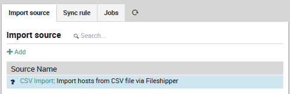
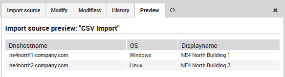

# <a id="ImportSource"></a> Use Text Files as an Import Source

The FileShipper interface allows you to import objects like hosts, users and groups from plain-text
file formats like CSV and JSON.

The documentation below assumes that you are [already familiar with Importing and Synchronization
in Director](/neteye/doc/icingaweb/chapter/automated-import).  Before using FileShipper, please be
sure that the module is ready by:

* Enabling it in **Configuration > Modules > fileshipper**.
* Creating paths for both the configuration and the files:
```
$ mkdir /neteye/shared/icingaweb2/conf/modules/fileshipper/
$ mkdir /data/file-import
```
And then defining a source path for those files within the following configuration file:
```
$ cat > /neteye/shared/icingaweb2/conf/modules/fileshipper/imports.ini
[NetEye File import]
basedir = "/data/file-import"
```


## <a id="fileshipper-importsource"></a>Adding a new Import Source

From **Director > Import data sources**, click on the "Add" action, then enter a name and description
for this import source.  For "Source Type", choose the "Import from files (fileshipper)" option as in
Figure 1.  The form will then expand to include several additional options.


**Figure 1:**  Choosing the FileShipper option.


## <a id="fileshipper-format"></a>Choose a File Format

Next, enter the name of the principal index column from the file, and choose your desired file type
from **File Format** as in Figure 2.


**Figure 2:**  Choosing the file format.

If you would like to learn more about the supported file formats, please read the
[file format documentation](11-FileFormats.md#FileFormats).


## <a id="fileshipper-file"></a>Select the Directory and File(s)

You will now be asked to choose a **Base Directory** (Figure 3).


**Figure 3:**  Choosing the base directory.

The FileShipper module doesn't allow you to freely choose any file on your system.  You must
provide a safe set of base directories in Fileshipper's configuration directory as described
in the first section above.  You can include additional directories if you wish by creating
each directory, and then modifying the configuration file, for instance:

```ini
[NetEye CSV File Import]
basedir = "/data/file-import/csv"

[NetEye XSLX File Import]
basedir = "/data/file-import/xslx"
```

Now you are ready to choose a specific file (Figure 4).


**Figure 4:**  Choosing a file or files.

**Note:** For some use-cases it might also be quite useful to import all files in a given
directory at once.

Once you have selected the file(s), press the "Add" button.  You will then see two additional
parameters to fill for the CSV files:  the delimiter character and field enclosure character
(Figure 5).  After filling them out, you will need to press the "Add" button a second time.


**Figure 5:**  Adding additional parameters.

The new synchronization rule will now appear in the list (Figure 6).  Since you have not
used it yet, it will be prefixed by a black question mark.



**Figure 6:**  The newly added import source.

Now follow the steps for **importing** at the page on
[Importing and Synchronization in Director](/neteye/doc/icingaweb/chapter/automated-import).
Once complete, you can then look at the Preview panel of the Import Source to check that
the CSV formatting was correctly recognized.  For instance, given this CSV file:

```
dnshostname,displayname,OS
ne4north1.company.com,NE4 North Building 1,Windows
ne4north2.company.com,NE4 North Building 2,Linux
```

then Figure 8 shows the following preview:



**Figure 7:**  Previewing the results of CSV import.

If the preview is correct, then you can proceed to Synchronization, or set up a Job to
synchronize on a regular basis.
