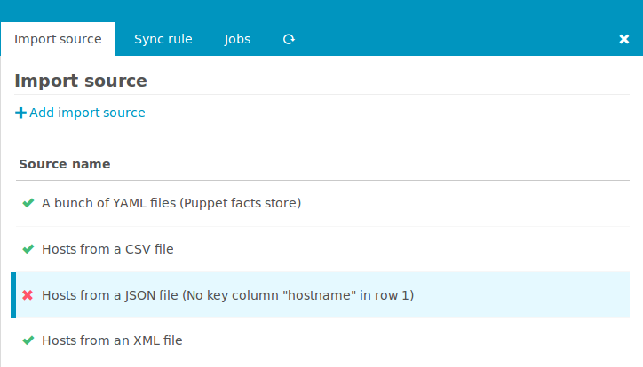
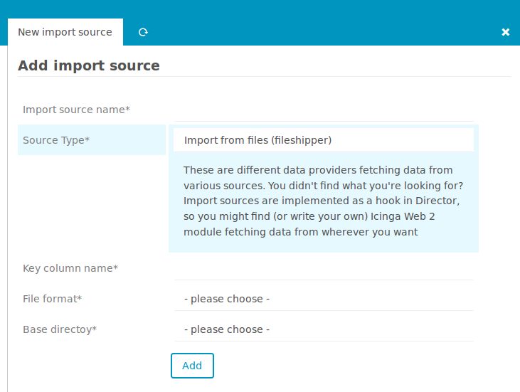
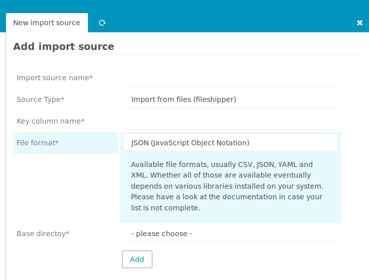
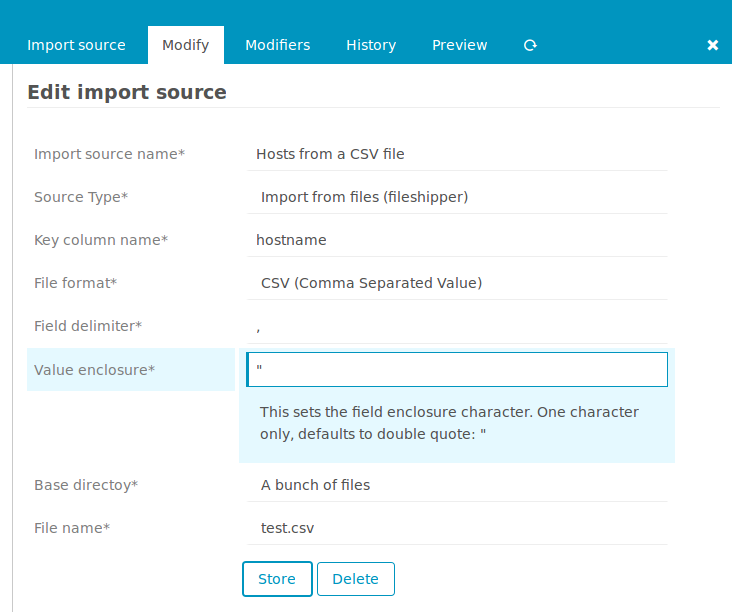
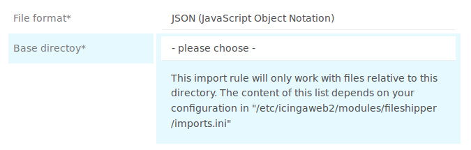
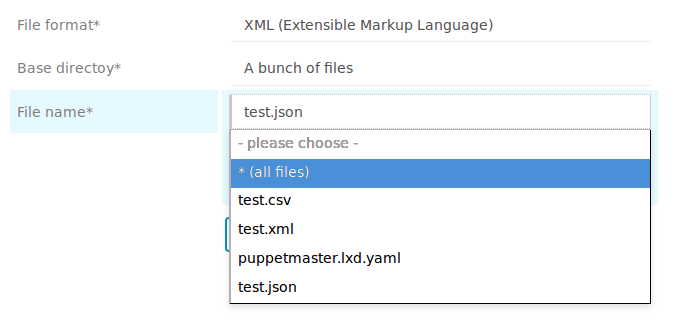
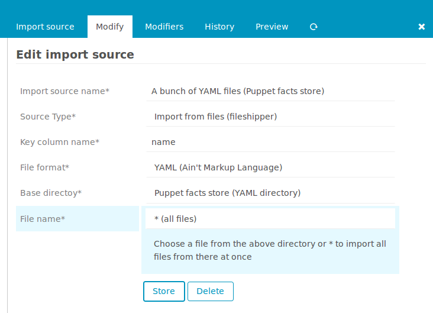

<a id="ImportSource"></a>Use plain files as an Import Source
============================================================

The following screenshot shows a bunch of `Import Source` definitions defined
in the `Icinga Director` based on the this module:



Hint: This chapter assumes that you are already familiar with the `Icinga Director`
[Import and Sync](https://github.com/Icinga/icingaweb2-module-director/blob/master/doc/70-Import-and-Sync.md) mechanism.


<a id="fileshipper-importsource"></a>Add a new Import Source
------------------------------------------------------------

Given that, the next steps should be fairly easy. From the Import Source overview
shown above click `Add import source` and choose the `Import from files` option
provided by the `fileshipper` module:




<a id="fileshipper-format"></a>Choose a File Format
---------------------------------------------------

Next opt for a specific `File Format`:



Some file formats may ask for additional settings like the `CSV` one does:



In case you want to learn more about supported file formats please read the
related [documentation](11-FileFormats.md).

<a id="fileshipper-file"></a>Select Directory and File(s)
---------------------------------------------------------

You are also asked to choose a `Base Directory`:



Initially, this list is empty. The module doesn't allow you to freely choose any
file on your system. You have to provide a safe set of base directories in your
`fileshipper`'s module config directory, usually `/etc/icingaweb2/modules/fileshipper`.
There you need to create an `imports.ini` that could look as follows:

```ini
[A bunch of files]
basedir = "/var/cache/various_files"

[Puppet facts store (YAML directory)]
basedir = "/var/cache/sample-nodes"
```

Now you are ready to choose a specific file:



For some use-cases it might also be quite useful to import `all files` in a given
directory at once:

<a id="fileshipper-puppet"></a>Special Use Case: Puppet
-------------------------------------------------------



The example on the screenshot has been configured to import all hosts from a
Puppet-based environment. If there where a PuppetDB it would have made more sense
to use the [PuppetDB module](https://github.com/Thomas-Gelf/icingaweb2-module-puppetdb).
But without such, the `facts store` on the Puppet Master makes still a good data
source for this task.
