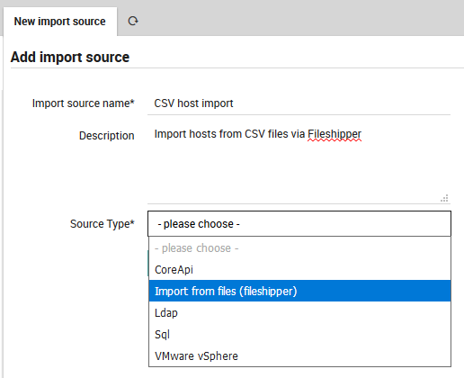

# <a id="ImportSource"></a> Use Text Files as an Import Source

The FileShipper interface allows you to import from plain-text file formats like CSV and JSON.

The documentation below assumes that you are already familiar with Importing and Synchronization
in Director.  Before using FileShipper, please be sure that the module is ready by:

* Enabling it in **Configuration > Modules > fileshipper**.
* Defining a path for files in **/neteye/shared/icingaweb2/conf/modules/fileshipper/imports.ini**:
```
$ mkdir /neteye/shared/icingaweb2/conf/modules/fileshipper/
$ mkdir /data/file-import
$ cat > /neteye/shared/icingaweb2/conf/modules/fileshipper/imports.ini
[NetEye File import]
basedir = "/data/file-import"
```


## <a id="fileshipper-importsource"></a>Adding a new Import Source

From **Director > Import data sources**, click on the "Add" action, then enter a name and description
for this import source.  For "Source Type", choose the "Import from files (fileshipper)" option as in
Figure 1.  The form will then expand to include several additional options.



**Figure 1:**  Choosing the FileShipper option.


## <a id="fileshipper-format"></a>Choose a File Format

Next, enter the name of the principal index column from the file, and choose your desired file type
from **File Format** as in Figure 2.


**Figure 2:**  Choosing the file format.

If you would like to learn more about the supported file formats, please read the
[file format documentation](11-FileFormats.md).


## <a id="fileshipper-file"></a>Select the Directory and File(s)

You will now be asked to choose a **Base Directory** (Figure 3).


**Figure 3:**  Choosing the base directory.

The FileShipper module doesn't allow you to freely choose any file on your system.  You must
provide a safe set of base directories in Fileshipper's configuration directory as described
in the first section above.  You can add additional directories if you wish by modifying
that file, for instance:

```ini
[NetEye File import]
basedir = "/data/file-import"

[Puppet facts store (YAML directory)]
basedir = "/data/puppet"
```

Now you are ready to choose a specific file (Figure 4).


**Figure 4:**  Choosing a file or files.

For some use-cases it might also be quite useful to import all files in a given
directory at once.

Finally, you need to indicate additional parameters specific to the type of file you are importing.
For instance, for CSV files you need to add the delimiter character and field enclosure character
as in Figure 5.


**Figure 5:**  Adding additional parameters.

You can now return to the Preview panel to check that the formatting was correctly recognized,
or the Import source panel to import the data.
